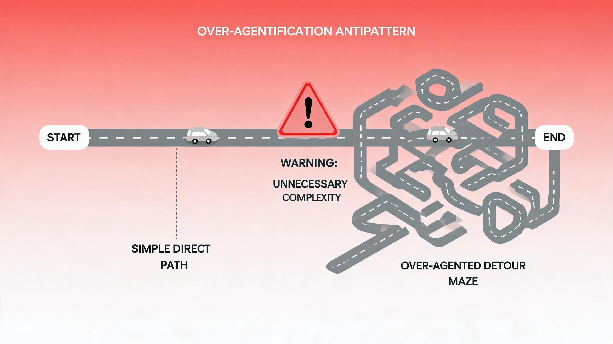

# 什么时候不该用 Agent:被过度 Agent 化的场景

> 探小虎 · 技术分享

Agent 是这两年的热词,什么任务都想往 Agent 上套——做个报表用 Agent,写个 CRUD 用 Agent,跑个数据迁移也用 Agent。仿佛不用 Agent 就落伍了。

但 Agent 不是银弹。**把确定性任务交给 Agent,本质上是用一个不确定的技术去解决一个确定的问题——不确定性不会消失,只会被凭空引入,转化为线上偶发故障。** 本文盘点被过度 Agent 化的反模式,给一个判断标准:什么时候该用 Agent,什么时候坚决不用。



---

## 一、先厘清:Agent 不是「更先进的代码」

最大的误解:把 Agent 当成「比传统代码更先进的实现方式」。这是错的。

**Agent 是用「模型推理」替代「硬编码逻辑」**。模型推理是非确定的——同一输入每次输出可能不同。所以 Agent 引入了一个传统代码没有的属性:**不确定性**。

```
传统代码:  输入 → 确定性逻辑 → 唯一输出
Agent:    输入 → 模型推理 → 可能不同的输出
```

这意味着,**只有当任务本身就带不确定性时,用 Agent 才是「对症」;如果任务本身是确定的,用 Agent 等于凭空引入本不存在的不确定性。**

> 一句话概括:**该不该用 Agent,不看任务难不难,看任务本身有没有不确定性。**

---

## 二、反模式一:把定时报表交给 Agent

最经典的过度 Agent 化:定时报表。

需求很简单:每天固定时间查数据、统计、生成 Markdown、推送。**输入固定、输出 schema 固定、流程固定、推送时间固定——它原本没有任何不确定性。**

一旦交给 ReActAgent,每天都会冒出新问题:

| 问题 | 根因 |
|:---|:---|:---|
| 字段偶发遗漏 | 模型生成 schema 不稳 |
| 统计口径漂移 | 模型每次「想」的算法可能不同 |
| 日期 off-by-one | 模型心算日期不准 |
| 提示词成「没编译器的代码」 | 调 bug 靠改措辞,没有单测兜底 |
| Token 浪费几十倍 | 为了固定输出跑多轮推理 |

> 教训:**把确定性问题交给不确定性技术,问题不会消失,只会转化为「线上偶发故障 + 提示词调优地狱」。** 正确做法是锚点时间用代码算、过滤分组用代码做,模型只在真正需要语义判断的单点用,甚至完全不用。

---

## 三、反模式二:把 CRUD 接口交给 Agent

另一个常见过度 Agent 化:让 Agent「根据需求生成 CRUD 接口」。

CRUD 是**结构高度固定**的任务——增删改查、参数校验、数据库映射,套路清晰、确定性极强。这种任务用 Agent,要么是「让模型每次重新现想一遍」,要么是「套模板但还要过模型一道」。

两种都亏:

- **重新现想**:每次生成结果不一致,代码风格漂移,review 成本高;
- **套模板过模型**:模板已经能确定输出,过模型一道纯属多此一举,还引入不确定性。

正确做法:**CRUD 这种结构化任务,用代码生成器/脚手架**,确定性、可测、快。Agent 只在「需求本身需要语义理解」时才上(比如「把这个自然语言需求转成 CRUD 草案」)。

---

## 四、反模式三:把数据迁移交给 Agent

数据迁移:把 A 表的数据按规则转到 B 表。**规则固定、数据是确定性的、要求精确。**

交给 Agent 的典型问题:模型心算数据转换容易算错、字段映射偶发漂移、大批量数据每条过模型成本爆炸、出错了难定位(是模型想错还是数据问题)。

**这种任务天然适合过程式代码**:规则清晰、可单测、可重放、可精确排障。过模型一道,除了引入不确定性,没有任何收益。

---

## 五、判断标准:不确定性归谁

把三个反模式收成一个判断标准,就回到第二篇的核心哲学:

> **先问:这个任务的不确定性,是任务本身固有的,还是我引入模型之后才产生的?**
>
> - 任务固有 → 交给模型(Agent)
> - 模型引入的 → 交给代码(过程式)

一张判断表:

| 任务特征 | 该不该用 Agent |
|:---|:---|
| 输入/输出/流程全固定 | **不用**,用代码 |
| 规则清晰、要求精确 | **不用**,用代码 |
| 大批量、重复性高 | **不用**,用代码 |
| 需求开放、方案不唯一 | **用**,Agent 适合 |
| 需要语义理解、自然语言 | **用**,Agent 适合 |
| 探索性、流程不确定 | **用**,Agent 适合 |

> 信号:**凡是「要求精确」的环节,都在被一点点从模型手里收回来。** 这是判断要不要用 Agent 的最强信号——任务要精确,别上 Agent。

---

## 六、什么时候该用 Agent

反过来,什么时候 Agent 是对的选择:

- **需求开放**:用户说「帮我改一下这个接口的错误处理」,改哪里、怎么改都靠模型判断;
- **需要语义理解**:自然语言需求、非结构化数据处理;
- **探索性任务**:方案不确定,需要边探边走的;
- **流程不固定**:每次的步骤可能不一样,硬编码覆盖不住。

这些场景,模型是唯一能消化不确定性的组件。**用 Agent 不是因为它先进,是因为任务本身就需要它。**

---

## 七、写在最后

1. **Agent 不是更先进的代码,是「用推理替代硬编码」。** 它引入不确定性,这是它的本质属性。
2. **不确定性该归谁,决定了该不该用 Agent。** 任务固有 → 模型;模型引入 → 代码。
3. **凡是要求精确的环节,都该从模型手里收回来。** 这是判断的最强信号。

Agent 很强,但 Agent 不是银弹。**把它用在它擅长的地方,它才真的强;把它用在它不擅长的地方,只会凭空引入麻烦。** 确定性归代码,不确定性归模型——边界清晰了,Agent 才是可信赖的生产力,而不是需要人盯着才不闯祸的黑盒。

---

> 如果这篇文章对你有启发,欢迎关注公众号「**探小虎**」,我会持续分享 AI Agent、后端架构与算法方面的技术思考。
>
> 相关阅读:《AI Agent 设计哲学:确定性归代码,不确定性归模型》《AI Agent 设计哲学:从「会聊天的模型」到「会做事的系统」》。
